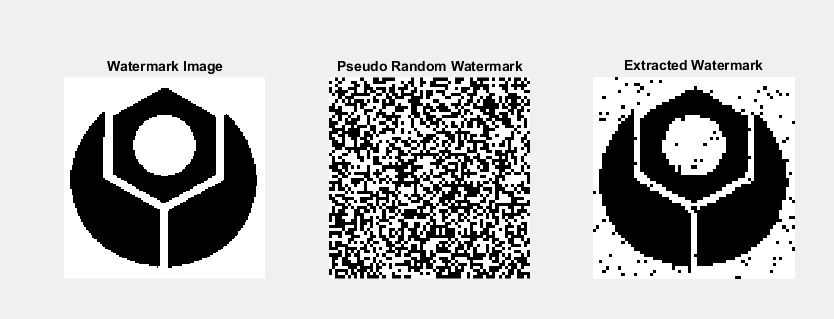
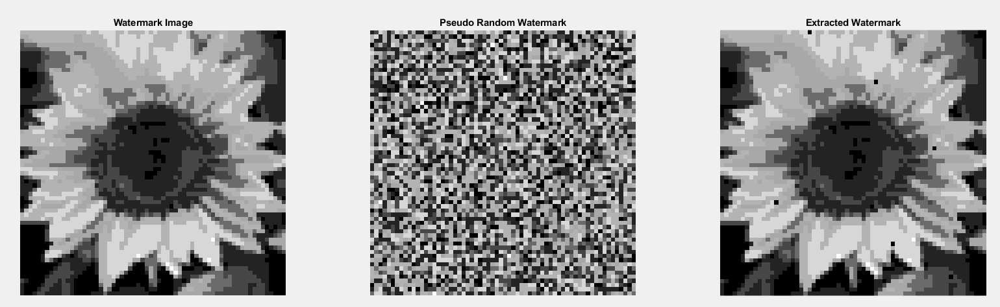

# A-Combined-Multitoning-and-Watermarking-Scheme-for-Clustered-Dot-Pattern

The page provides the code to perform joint multitoning and watermarking for Clustered Dot Multitone Images

The details of the page are as follows:

Image Database.zip contains two folders

1) TEST Images: Contains 100 images of size 1024x1024
2) 2-Tone Watermark Image: Contains 10 binary image 
 

# Binary Watermark embedding in 3-tone (multitone) image
To execute the code 

Run 2-Tone/test.m file.. 

## Original Image

 

## Multitone Image and Watermarked Multitone Image
 
  
 

## Output Figure
 

# 8-Tone Watermark embedding in 3-tone (multitone) image
To execute the code 

Run 8-Tone/test.m file.. 

## Watermarked Multitone Image
 

## Output Figure
 

 
 
 
 
