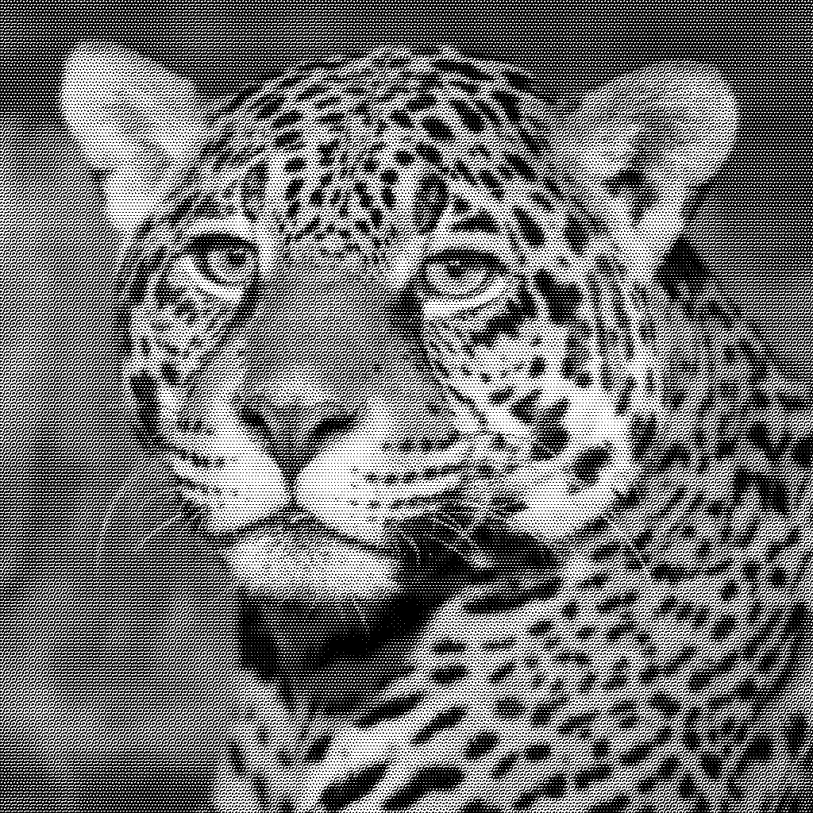

# Hybrid Multitoning and Watermarking for Clustered-Dot Dithering 
or
# A-Combined-Multitoning-and-Watermarking-Scheme-for-Clustered-Dot-Pattern

The page provides the code to perform joint multitoning and watermarking for Clustered Dot Multitone Images

The details of the page are as follows:

* Image Database.zip contains two folders

1) TEST Images: Contains 100 images of size 1024x1024
2) 2-Tone Watermark Image: Contains 10 binary image. 

* 2-Tone
**Source Code to perform 2-Tone Watermark in 3-Tone Multitone Image**

* 8-Tone
**Source Code to perform 8-Tone Watermark in 3-Tone Multitone Image**

## NOTE

The paper is still in review. After the publication, the code for intertone shifting and a decoding strategy using stochastic statistics will be uploaded. 
 

# Binary Watermark embedding in 3-tone (multitone) image
To execute the code 

Run 2-Tone/test.m file.. 

## Original Image

 

## Multitone Image and Watermarked Multitone Image
 
  
 

## Program Output 
 

# 8-Tone Watermark embedding in 3-tone (multitone) image
To execute the code 

Run 8-Tone/test.m file.. 

## Original Image
 

## Multitone Image and Watermarked Multitone Image
 
  

## Program Output
 

 
 
 
 
